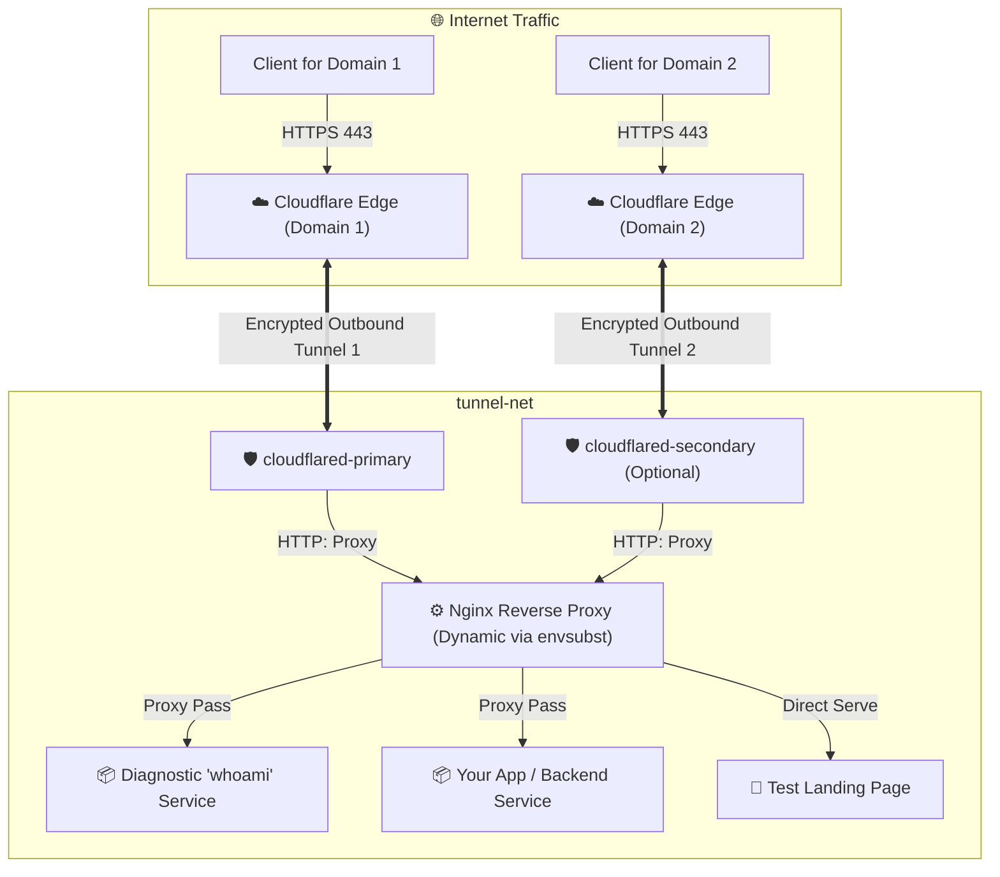

# 100% ENV-Driven Docker Setup: Multi-Cloudflare Tunnel + Nginx (Zero Open Inbound Ports)

[](LICENSE)
[](docker-compose.yml)
[](https://www.cloudflare.com/products/tunnel/)

A complete, production-ready Docker Compose environment for hosting web applications without opening **any inbound ports** (no port 80 or 443 required on your host/router/firewall).

**⚡ Fully Environment-Variable Driven**: No need to edit `config.yml` or manual Nginx configuration files! Just set variables in your `.env` file and deploy.

---

## 🌟 Why This Architecture?

| Feature | Traditional Hosting | This ENV-Based Tunnel Setup |
| :--- | :--- | :--- |
| **Inbound Ports** | Requires port 80 & 443 open | **0 inbound ports open** (100% outbound tunnel) |
| **Configuration** | Manual YAML / vhost files | **100% ENV driven via `.env`** |
| **Multi-Tunnel** | Complex routing tables | **Run 1, 2, or more tunnels side-by-side** |
| **IP / CGNAT** | Requires Public Static IP | Works behind CGNAT, home broadband, or private VPS |
| **Security & DDoS**| Direct server exposure | Protected by Cloudflare WAF, DDoS, & SSL Edge |
| **Client Real IP** | Often lost behind reverse proxy | Automatic `CF-Connecting-IP` restoration in Nginx |

---

## 🏗️ Architecture Diagram



---

## 📁 Directory Structure

```
tunneled/
├── docker-compose.yml                 # Multi-tunnel orchestration (0 host ports open)
├── .env.example                      # Complete environment configuration template
├── .gitignore                        # Prevents credential leaks
├── README.md                         # Documentation
├── cloudflared/
│   ├── entrypoint.sh                 # Smart entrypoint: detects token vs auto-config
│   ├── config.yml                    # (Optional) local fallback config
│   └── credentials/                  # (Optional) folder for local json credentials
├── nginx/
│   ├── nginx.conf                    # Nginx core config (Real IP & logging)
│   ├── conf.d/
│   │   └── security_headers.conf     # Security response headers snippet
│   └── templates/
│       └── default.conf.template     # Dynamic reverse proxy vhost (envsubst)
└── sample-app/
    └── html/
        └── index.html                # Landing page
```

---

## 🚀 Quick Setup (In 2 Minutes)

### Step 1: Copy the `.env` template
```bash
cp .env.example .env
```

### Step 2: Configure your `.env`

Open `.env` and configure your tunnel token and target app:

```env
# 1. Primary Cloudflare Tunnel Token (from Cloudflare Zero Trust Dashboard)
TUNNEL_TOKEN_PRIMARY=eyJhIjoi...

# 2. Your Domain Name
PRIMARY_DOMAIN=app.yourdomain.com

# 3. Target application container name and port (default: whoami diagnostic app)
UPSTREAM_APP_HOST=whoami
UPSTREAM_APP_PORT=80
```

> **How to get your `TUNNEL_TOKEN` from Cloudflare:**
> 1. Go to [Cloudflare Zero Trust Dashboard](https://one.dash.cloudflare.com/) $\rightarrow$ **Networks** $\rightarrow$ **Tunnels**.
> 2. Click **Create a Tunnel** $\rightarrow$ select **Cloudflared**.
> 3. Under "Install and run a connector", choose **Docker** and copy the token string from `cloudflared.exe tunnel run --token <TOKEN>`.
> 4. In the Public Hostname tab, map `app.yourdomain.com` to `http://nginx:80`.

### Step 3: Start the stack
```bash
docker compose up -d
```

That's it! Your application is now live on `https://app.yourdomain.com` with zero open ports on your firewall.

---

## 🔀 Multi-Tunnel Setup (Running Multiple Tunnels Concurrently)

If you have multiple domains, client apps, or separate Cloudflare accounts, you can run multiple tunnels on the same Docker network simultaneously.

1. In `.env`, add the second token and enable the profile:
   ```env
   TUNNEL_TOKEN_PRIMARY=eyJhIjoi...primary-token...
   TUNNEL_TOKEN_SECONDARY=eyJhIjoi...secondary-token...
   COMPOSE_PROFILES=multi-tunnel
   ```

2. Start the stack:
   ```bash
   docker compose up -d
   ```
   *Both `cloudflared_primary` and `cloudflared_secondary` will start and route traffic through Nginx.*

---

## 🧩 Connecting Your Own Custom Backend Application

1. **Add your backend app container to [`docker-compose.yml`](file:///Users/falgun/Work/tunneled/docker-compose.yml)**:
   ```yaml
   my-backend:
     build: ./my-backend
     container_name: my_backend
     restart: unless-stopped
     expose:
       - "3000"
     networks:
       - tunnel-net
   ```

2. **Update `.env`**:
   ```env
   UPSTREAM_APP_HOST=my_backend
   UPSTREAM_APP_PORT=3000
   ```

3. **Restart the stack**:
   ```bash
   docker compose up -d
   ```
   Nginx will automatically rebuild its configuration with the new upstream container host and port!

---

## 🛡️ Key Security Features

- **Real IP Restoration**: `nginx.conf` trusts Cloudflare proxy subnets and internal Docker ranges, mapping `CF-Connecting-IP` to `$remote_addr`.
- **Security Headers**: Standard OWASP-recommended headers (`X-Frame-Options`, `X-Content-Type-Options`, `Referrer-Policy`, `Permissions-Policy`).
- **Isolation**: Containers communicate exclusively over the internal bridge network `tunnel-net`. Host networking and host port exposures are eliminated.
- **Git Security**: `.gitignore` strictly prevents committing `.env` or `.json` tunnel credentials.

---

## 🛠️ Useful Management Commands

| Task | Command |
| :--- | :--- |
| **Start single tunnel** | `docker compose up -d` |
| **Start with multi-tunnel profile** | `docker compose --profile multi-tunnel up -d` |
| **Check container statuses** | `docker compose ps` |
| **View real-time primary tunnel logs** | `docker compose logs -f cloudflared-primary` |
| **View real-time secondary tunnel logs**| `docker compose logs -f cloudflared-secondary` |
| **View Nginx logs with real visitor IPs**| `docker compose logs -f nginx` |
| **Stop stack** | `docker compose down` |
